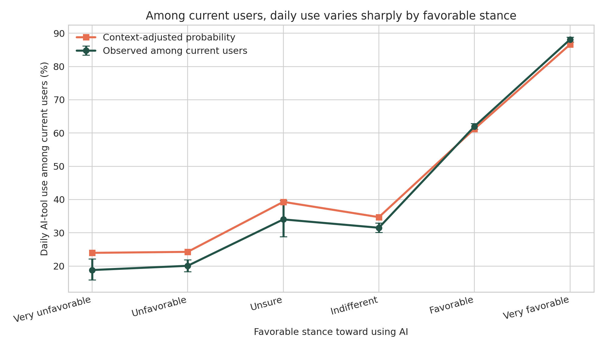
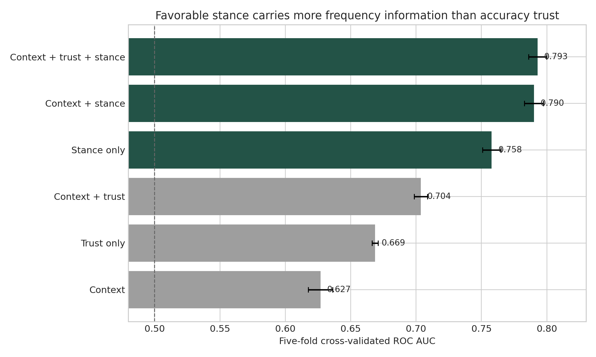

# The Developers Using AI Without Trusting It

*What 26,102 current users in Stack Overflow's 2025 survey reveal about adoption, sentiment, and calibrated skepticism*

If trust were the price of admission, the AI boom would make no sense.

Developers know these tools are unreliable. They see answers that are almost right. They lose time debugging code that looked plausible. They verify, revise, discard, and sometimes start over. And they keep using the tools anyway.

Stack Overflow's [2025 Developer Survey](https://survey.stackoverflow.co/2025/ai) captured the apparent contradiction. AI use continued to grow while confidence in output accuracy fell. More respondents actively distrusted AI accuracy than trusted it.

The usual interpretation is that AI has a trust problem. Fix the reliability, close the trust gap, and adoption will follow.

That may be the wrong model.

I reanalyzed the public survey data to ask a narrower question. Among people who already use AI tools, which tells us more about whether they use them daily: their trust in the accuracy of AI output, or their overall stance toward using AI in their workflow?

The difference was not small.

## The finding

The analysis focuses on 26,102 respondents who reported currently using AI tools and answered the relevant use, stance, and accuracy-trust questions.

Their reported daily-use rates differed sharply by favorable stance:

- Very unfavorable: **18.8%**
- Unfavorable: **20.1%**
- Unsure: **34.0%**
- Indifferent: **31.5%**
- Favorable: **62.0%**
- Very favorable: **88.1%**

*Figure 1. Reported daily use among current AI-tool users by favorable stance. The middle categories are not perfectly ordered.*

This is not a smooth psychological scale. Unsure respondents reported slightly more daily use than indifferent respondents. That is why the analysis treats each answer as a category instead of pretending the six positions sit at perfectly equal intervals.

But the larger separation is unmistakable: unfavorable and favorable current users behave very differently.

Accuracy trust also distinguishes more frequent from less frequent users—but much less strongly.

In five-fold cross-validation, a model using favorable stance alone reached a ROC AUC of **0.758**. A model using accuracy trust alone reached **0.669**. In ordinary language, stance did considerably more to distinguish daily users from less-frequent users within this sample.

Adding respondent context—such as experience, role, organization size, work mode, perceived AI threat, and country—did not erase the difference:

- Context plus accuracy trust: **0.704**
- Context plus favorable stance: **0.790**
- Context plus both: **0.793**

*Figure 2. Cross-validated classification of daily versus less-frequent use among current AI-tool users.*

Across 50 matched train-test splits, the context-plus-stance model outperformed the context-plus-trust model every time. Trust still added a small, consistently positive amount after stance and context were known. It was not irrelevant. It simply carried far less information about use frequency.

## The stranger result

The most revealing comparison may be among respondents who said they **highly distrust** the accuracy of AI output.

Within that group of current users, daily use ranged from **17.7%** among the very unfavorable to **85.1%** among the very favorable.

Read that again: some of the people most skeptical of AI accuracy were also among its most frequent users.

That does not mean they secretly trusted it. It may mean they found it useful while assuming that every output needed inspection. It may mean they used it for low-risk tasks, generated alternatives rather than answers, or accepted verification as part of the workflow. The survey cannot tell us which explanation is correct.

But it can tell us that favorable stance and accuracy trust are not interchangeable.

## “Sentiment” is doing more work than it appears

Stack Overflow labels its survey item “AI tool sentiment.” The actual question asks how favorable respondents are toward using AI tools as part of their development workflow.

I use the term **favorable stance** because this is not a validated psychological sentiment scale. It is one broad self-report. It may compress several things into a single answer:

- whether the tool feels useful;
- whether it fits the person's work;
- whether using it feels legitimate or professionally acceptable;
- whether prior experiences were rewarding;
- whether the person believes the benefits justify the verification burden;
- whether AI feels like an extension of the workflow or an intrusion into it.

That breadth is part of why stance may align so strongly with use. Trust in accuracy asks a narrower question: “Do I believe the output is correct?” Favorable stance asks something closer to: “Am I for or against using this at all?”

This is both the finding and its strongest limitation.

## The strongest counterargument

A critic could reasonably say the result is almost tautological.

If you ask people whether they favor using AI and then ask how often they use it, the answers should be related. Accuracy trust is farther from the behavior, so of course it classifies use less strongly.

That objection is valid.

The analysis reduces the problem by excluding non-users and comparing daily with less-frequent use only among current users. The association remains large. But restricting the sample cannot make the concepts fully independent. Favoring AI use is still semantically closer to using AI than trusting the accuracy of its output.

So the responsible conclusion is not that stance is the hidden psychological cause of adoption. It is narrower:

> Accuracy trust alone is an incomplete account of how people orient toward using AI.

There are other serious limitations. The survey is voluntary, not a representative sample of every developer. The measures and outcome are single, same-session self-reports. Use may create favorable stance rather than the other way around. Successful experiences, role fit, employer expectations, access, task mix, or simple rationalization could explain the pattern. Cross-validation tests classification stability inside this dataset; it does not turn a cross-sectional survey into a forecast or a causal experiment.

Those are not footnotes to hide. They define what the result means.

## Trust may govern how we use AI—not whether we use it

Organizations often treat “trust” as one thing. Employees either trust AI and adopt it, or distrust AI and resist it.

The data suggest a more useful separation:

- **Behavior:** What are people actually doing, and how often?
- **Favorable stance:** Do they see AI use as worthwhile, fitting, or legitimate?
- **Accuracy trust:** How much confidence do they place in the output?
- **Verification burden:** What review, testing, correction, and rework does use require?
- **Outcomes:** Does the work become faster, better, safer, or more capable?

A person can score high on use and favorable stance while scoring low on accuracy trust. That may be exactly what competent use looks like in an unreliable environment.

The goal should not be maximum trust. It should be **calibrated reliance**: knowing when to use the tool, what to delegate, what to verify, and when to reject the answer.

That is a very different organizational challenge.

## What leaders should test next

This analysis does not prove that changing employee sentiment will cause adoption. It does suggest that “make people trust AI more” is too blunt a change strategy.

Instead, organizations can test several separate questions:

1. **Does the tool create enough value to justify the verification burden?**  
   People may rationally distrust outputs and still use the tool because the net value is positive.

2. **Does AI fit the work people are actually responsible for?**  
   Generic demonstrations create awareness. Repeated use on authentic tasks reveals fit.

3. **Do people know how to challenge and verify an output?**  
   Appropriate skepticism can support use. Helpless skepticism stops it.

4. **Does the organization make experimentation legitimate?**  
   Policies, manager behavior, peer norms, access, and psychological safety may shape favorable stance without changing beliefs about accuracy.

5. **Are we measuring behavior and outcomes—or only asking how people feel?**  
   Self-report belongs beside workflow telemetry, quality measures, rework, defects, and learning.

This is why I increasingly prefer **rehearsal over training** for AI adoption. A course can tell someone what a model does. Rehearsal lets them experience where it helps, where it fails, and what responsible reliance feels like in their own work.

That is a hypothesis for organizations to test—not a result established by this survey.

## Adoption without confidence is not a contradiction

The broad story from the 2025 survey was that AI use rose while trust fell.

The more interesting story may be that trust in accuracy was never the whole adoption equation.

People use technologies they do not fully trust all the time. They compensate with checks, constraints, redundancy, judgment, and experience. The question is not whether they believe every output. It is whether the technology earns a place in the workflow despite its imperfections.

Among these 26,102 current AI-tool users, favorable stance carried substantially more information about daily use than accuracy trust did. That does not tell us which came first. It does tell us that adoption, favorability, trust, verification, and value should not be collapsed into one number.

Access is not adoption. Favoring use is not trusting output. Frequent use is not calibrated reliance.

Measure each one. Then test what changes.

---

## About the analysis

This article reports a secondary analysis of the public 2023-2025 Stack Overflow Developer Survey files. The primary analysis uses 26,102 current AI-tool users from the 2025 complete-case sample and compares daily with less-frequent reported use. The complete methods, denominators, code, robustness checks, claim boundaries, and machine-readable results are available in the accompanying open research note and repository.

### Suggested citation

Penzell, J. (2026). *Adoption Without Confidence? Favorable Stance, Accuracy Trust, and Reported AI-Use Frequency in the 2025 Stack Overflow Survey.* Imagination Applied Open Research Series.
